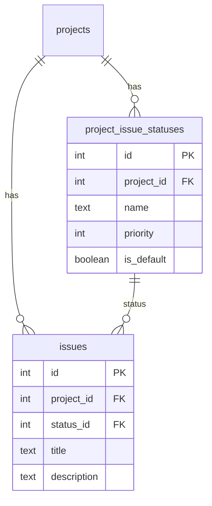

# Project-Specific Issue Statuses

## Goal

Replace hardcoded issue statuses with project-specific statuses. Each project has its own set of statuses (default: backlog, todo, in progress, done). Issues reference status by FK.

## Architecture




## Key Decisions

- **status_id in issues** — FK to `project_issue_statuses.id`, `ON DELETE restrict` (prevent delete if issues use it)
- **Default statuses** — backlog, todo, in progress, done (priority 0–3), backlog is_default
- **New projects** — ProjectsService.createProject inserts 4 default statuses
- **Forms** — Receive statuses as prop from page (SSR fetch), use statusId in schema and submit payload

## Files to Change


| Area     | Files                                                                                                                                                                   |
| -------- | ----------------------------------------------------------------------------------------------------------------------------------------------------------------------- |
| Schema   | [src/db/schema/project-issue-statuses.ts](src/db/schema/project-issue-statuses.ts) (new), [src/db/schema/issues.ts](src/db/schema/issues.ts)                            |
| Services | [src/modules/issues/service.ts](src/modules/issues/service.ts), [src/modules/projects/service.ts](src/modules/projects/service.ts)                                      |
| API      | [src/app/(restricted)/api/...] or Elysia project routes — add GET statuses                                                                                              |
| Model    | [src/modules/issues/model.ts](src/modules/issues/model.ts)                                                                                                              |
| Forms    | [src/components/create-issue-form.tsx](src/components/create-issue-form.tsx), [src/components/edit-issue-form.tsx](src/components/edit-issue-form.tsx)                  |
| Pages    | [src/app/(restricted)/[slug]/projects/[id]/issues/new/page.tsx](src/app/(restricted)/[slug]/projects/[id]/issues/new/page.tsx), edit page                               |
| Actions  | [src/app/(restricted)/[slug]/projects/[id]/issues/new/actions.ts](src/app/(restricted)/[slug]/projects/[id]/issues/new/actions.ts), edit actions                        |
| Display  | [src/components/issues-table.tsx](src/components/issues-table.tsx), [src/components/issues-table-static.tsx](src/components/issues-table-static.tsx), issue detail page |


## Implementation

### 1. Cleanup plans folder

Delete from `.cursor/plans/` any plans older than 7 days or without `YYYY-MM-DD`_ prefix.

### 2. Database schema

**New** [src/db/schema/project-issue-statuses.ts](src/db/schema/project-issue-statuses.ts):

- Table: `id`, `project_id` (FK projects, cascade), `name` (text), `priority` (integer), `is_default` (boolean, default false)
- Export: insert/select/update schemas, types

**Update** [src/db/schema/issues.ts](src/db/schema/issues.ts):

- Add `statusId: integer("status_id").references(() => projectIssueStatusesTable.id, { onDelete: "restrict" }).notNull()` after migration step
- Remove `status` after migration (handled in migration SQL)

### 3. Migration (Drizzle + manual data steps)

Run `bun run app:db:generate` to produce initial migration. Then edit the generated SQL file to add data migration:

1. CREATE TABLE project_issue_statuses
2. ALTER TABLE issues ADD COLUMN status_id integer REFERENCES project_issue_statuses(id) ON DELETE restrict
3. INSERT default statuses for each project:

```sql
INSERT INTO project_issue_statuses (project_id, name, priority, is_default)
SELECT p.id, s.name, s.priority, s.is_default
FROM projects p
CROSS JOIN (VALUES
  ('backlog', 0, true),
  ('todo', 1, false),
  ('in progress', 2, false),
  ('done', 3, false)
) AS s(name, priority, is_default);
```

1. UPDATE issues SET status_id from project_issue_statuses by matching project_id and LOWER(TRIM(status)) = LOWER(TRIM(name))
2. For rows with NULL status_id: SET to backlog (min priority) of that project
3. ALTER issues ALTER COLUMN status_id SET NOT NULL
4. ALTER issues DROP COLUMN status

### 4. ProjectStatusesService

**New** [src/modules/project-statuses/service.ts](src/modules/project-statuses/service.ts):

- `getStatusesByProjectId(userId, projectId)` — verify access via ProjectsService.getProjectById, return statuses ordered by priority
- Return shape: `{ id, name, priority, isDefault }[]`

### 5. ProjectsService.createProject

After INSERT project, insert 4 default statuses into `project_issue_statuses` (backlog, todo, in progress, done).

### 6. IssuesService updates

- `createIssue`: accept `statusId` instead of `status`, validate status belongs to project
- `updateIssue`: accept `statusId` instead of `status`, same validation
- `getIssueById`, `getIssuesByProjectId`: JOIN project_issue_statuses, return `statusId`, `status` (name) in IssueView

### 7. API: GET project statuses

Add to projects routes (Elysia): `GET /projects/:id/statuses` → ProjectStatusesService.getStatusesByProjectId. Used by forms when fetching via client, or we pass from server — forms are client components, so either:

- A) Page (SSR) fetches statuses, passes to form as prop
- B) Form fetches statuses via `fetch(/api/.../statuses)` on mount

Option A avoids extra request. Page has projectId from params; for create page we have project, for edit we have issue.projectId.

### 8. Model and form schema

- `CreateIssueBody`, `UpdateIssueBody`: `statusId: number` instead of `status?: string`
- `IssueView`: `statusId: number`, `status: string` (name for display)
- Form schemas: `statusId: Type.Number()` required for update, optional with default for create

### 9. Forms

- **CreateIssueForm**: props add `statuses: { id: number; name: string }[]`, default status = first (backlog). Select uses statusId, submits statusId.
- **EditIssueForm**: same props, default value issue.statusId. Submit statusId.

### 10. Pages (SSR statuses)

- **new/page.tsx**: Fetch statuses via ProjectStatusesService.getStatusesByProjectId(session.user.id, projectId), pass to CreateIssueForm
- **edit/[issueId]/page.tsx**: Fetch statuses via issue.projectId, pass to EditIssueForm

### 11. Actions

- createIssue, updateIssue: accept statusId, pass to service

### 12. Display components

- issues-table.tsx, issues-table-static.tsx, issue detail page: display `issue.status` (name) — no change if we keep that field in IssueView

### 13. Run migrate

```bash
bun migrate
```

### 14. Testing and commit

- Create new issue: verify status select shows project statuses, submission works
- Edit issue: verify status change persists
- Verify existing issues display correct status after migration
- Do NOT commit until user confirms; then commit and push.

