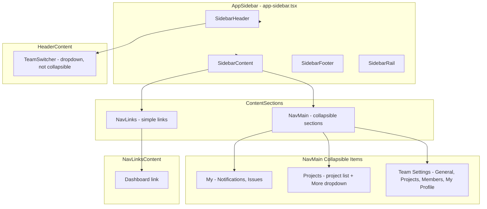

# Sidebar Analysis and Collapsible Defaults

## Implementation Steps

1. **Cleanup plans folder** — Delete from `.cursor/plans/` files older than 7 days (by YYYY-MM-DD in filename) or without `YYYY-MM-DD_` prefix.
2. Apply changes below.

---

## 1. Plan Filename Convention

**Requirement:** Add date to plan filename when planning; save plans to `.cursor/plans/`.

**Convention:** Use `YYYY-MM-DD_plan_topic.plan.md` format (e.g. `2025-03-15_sidebar_collapsible_defaults.plan.md`).

**Implementation:** This is a process/documentation rule. When creating new plans:

- Use date-prefixed names in the plan `name` parameter (e.g. `2025-03-15 Sidebar Analysis`)
- Plans are saved to [.cursor/plans/](.cursor/plans/) by Cursor

---

## 2. Sidebar Architecture Analysis




### Components


| Component        | File                                                                 | Behavior                                                                  |
| ---------------- | -------------------------------------------------------------------- | ------------------------------------------------------------------------- |
| **AppSidebar**   | [src/components/app-sidebar.tsx](src/components/app-sidebar.tsx)     | Root sidebar with `collapsible="icon"` (whole sidebar collapses to icons) |
| **TeamSwitcher** | [src/components/team-switcher.tsx](src/components/team-switcher.tsx) | Team dropdown in header; not a collapsible                                |
| **NavMain**      | [src/components/nav-main.tsx](src/components/nav-main.tsx)           | Three collapsible sections: My, Projects, Team Settings                   |
| **NavLinks**     | [src/components/nav-links.tsx](src/components/nav-links.tsx)         | Links group (Dashboard); no collapsibles                                  |
| **NavUser**      | (footer)                                                             | User profile; not collapsible                                             |


### Collapsible Logic (NavMain)

In [src/components/nav-main.tsx](src/components/nav-main.tsx) lines 96-101:

```tsx
<Collapsible
  asChild
  className="group/collapsible"
  defaultOpen={item.isActive}  // Only Projects has isActive: true
  key={item.title}
>
```

- **My**: `defaultOpen={false}` (no `isActive`)
- **Projects**: `defaultOpen={true}` (`isActive: true` in data)
- **Team Settings**: `defaultOpen={false}`

---

## 3. Make All Collapsible Items Opened by Default

**File:** [src/components/nav-main.tsx](src/components/nav-main.tsx)

**Change:** Replace `defaultOpen={item.isActive}` with `defaultOpen={true}` so My, Projects, and Team Settings are all expanded by default.

```tsx
// Before
defaultOpen={item.isActive}

// After
defaultOpen={true}
```

**Optional cleanup:** Remove `isActive` from the nav data in [src/components/app-sidebar.tsx](src/components/app-sidebar.tsx) (line 41) since it will no longer affect initial state. This is optional—keeping it does not cause issues.

---

## 4. Commit and Push (After Confirmation)

**Requirement:** After the user confirms the implementation is complete and satisfactory:

- Stage changes: `git add` (files modified per this plan)
- Commit with a descriptive message (e.g. `chore(sidebar): make all nav collapsibles open by default`)
- Push to the remote: `git push`

